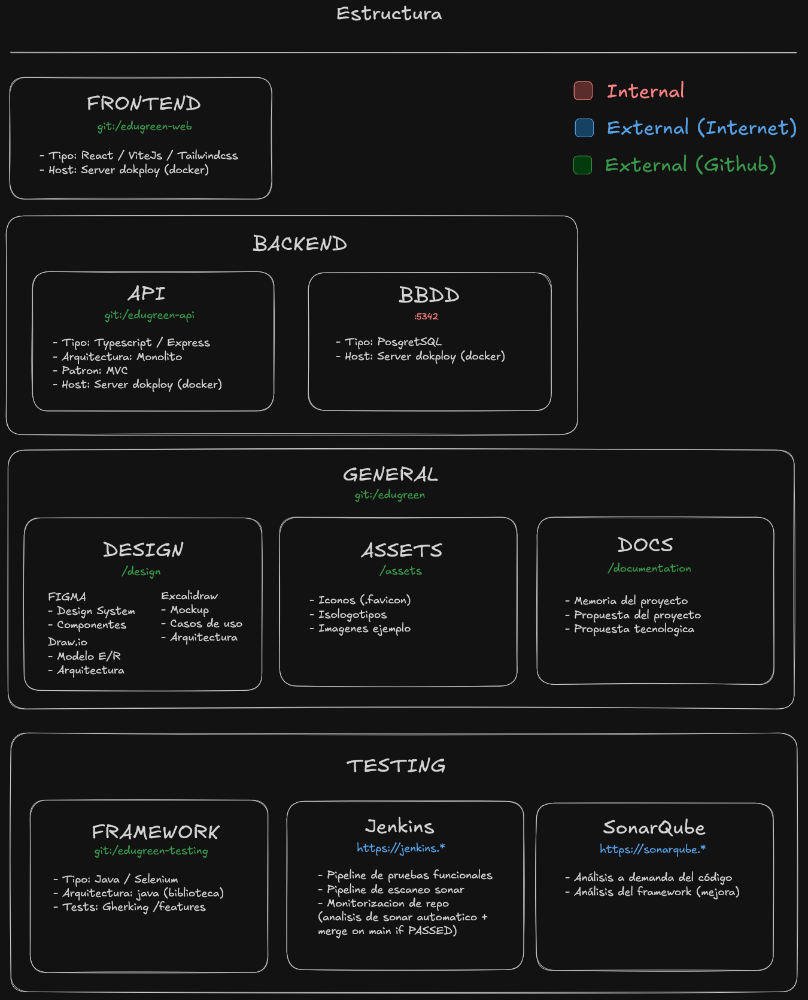
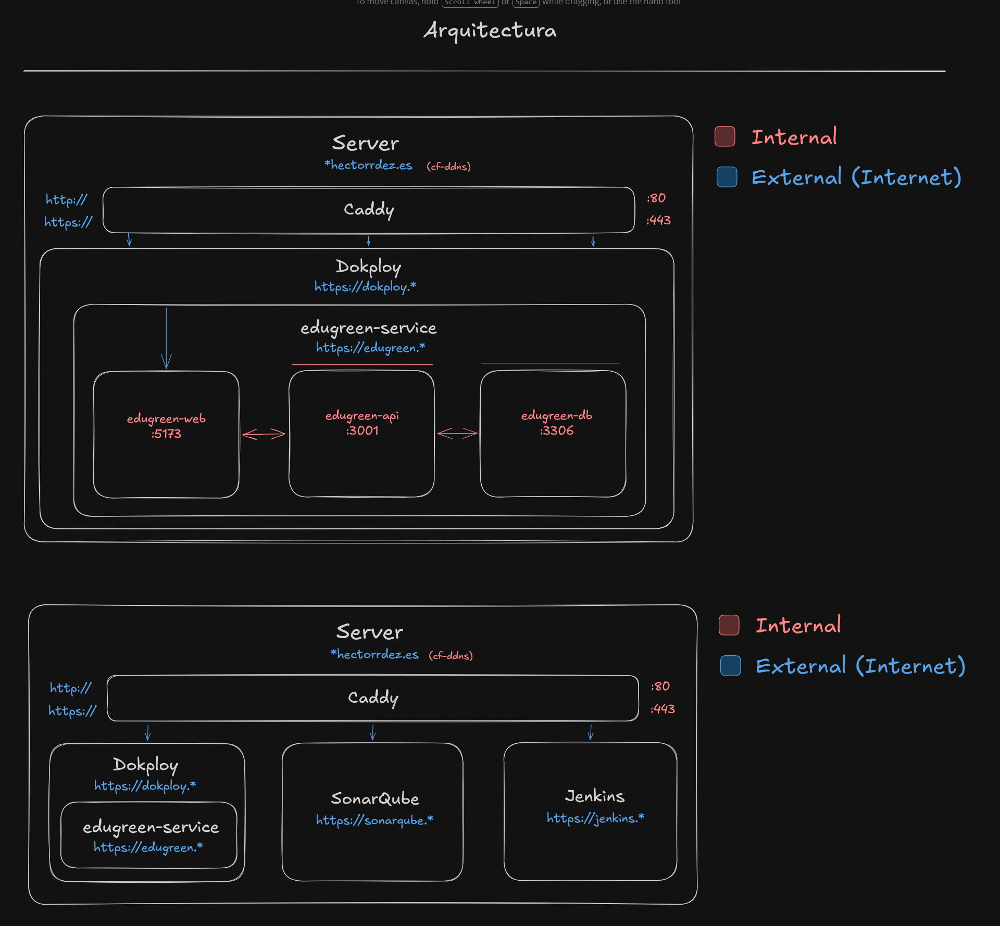

# EduGreen

**Plataforma de Educación Ambiental Interactiva**

EduGreen es una plataforma web interactiva orientada a estudiantes de secundaria y bachillerato cuyo objetivo es fomentar la conciencia ambiental mediante el aprendizaje activo y la gamificación.

A través de retos semanales, minijuegos, cuestionarios y recursos multimedia, los alumnos aprenden sobre sostenibilidad, reciclaje, consumo responsable y cuidado del medioambiente de forma participativa y divertida. Los docentes pueden gestionar grupos, crear retos personalizados y acceder a estadísticas de progreso del alumnado.

> Alineado con el **ODS 4 — Educación de calidad** y el **ODS 13 — Acción por el clima**.

---

## Repositorios del proyecto

Este repositorio es el hub central del proyecto EduGreen. Contiene la documentación, los recursos de diseño y los assets compartidos entre el resto de repositorios.



| Repositorio | Descripción | Tecnologías |
|---|---|---|
| `edugreen` *(este repo)* | Hub central: documentación, diseño y assets | — |
| `edugreen-web` | Aplicación frontend | React, Vite, Tailwind CSS |
| `edugreen-api` | API REST backend | TypeScript, Express, Arquitectura MVC |
| `edugreen-testing` | Suite de pruebas | Jest, Selenium |

### Contenido de este repositorio

```
edugreen/
├── assets/       # Iconos, isotipología e imágenes del proyecto
├── design/       # Design system, componentes, marca y arquitectura (Figma)
└── docs/         # Memoria del proyecto y propuestas técnicas
```

---

## Arquitectura del sistema

EduGreen se despliega sobre dos servidores: uno de **producción** y otro de **DevOps**, ambos gestionados con Caddy como proxy inverso y Dokploy como plataforma de despliegue.



### Servidor de producción

El tráfico HTTP/HTTPS entra por Caddy y se enruta al servicio `edugreen-service`, que agrupa los tres contenedores de la aplicación:

- **`edugreen-web`** — Interfaz React (puerto 5173)
- **`edugreen-api`** — API REST Express (puerto 3001)
- **`edugreen-db`** — Base de datos PostgreSQL (puerto 3306)

### Servidor DevOps

Aloja las herramientas de integración continua y calidad de código:

- **Jenkins** — Pipelines de despliegue, análisis Sonar y ejecución de tests. El merge a `main` solo se realiza si los tests pasan.
- **SonarQube** — Análisis de calidad del código bajo demanda y por acción del framework de testing.
- **Dokploy** — Gestión de servicios y contenedores Docker.

---

## Stack tecnológico

| Capa | Tecnología |
|---|---|
| Frontend | React + Vite, TypeScript, Tailwind CSS |
| Backend | Node.js, Express, TypeScript |
| Base de datos | PostgreSQL (Docker) |
| Testing | Jest (unitario), Selenium (funcional/E2E) |
| CI/CD | Jenkins, SonarQube |
| Despliegue | Docker, Dokploy, servidor propio |
| Proxy inverso | Caddy |
| Control de versiones | GitHub |

---

## Módulos de la aplicación

- **Autenticación** — Registro, login y roles (alumno / docente) con JWT.
- **Retos** — Creación, seguimiento y validación de desafíos ambientales semanales.
- **Gamificación** — Sistema de puntos, niveles y ranking escolar.
- **Módulo educativo** — Recursos multimedia, minijuegos y cuestionarios.
- **Panel docente** — Gestión de clases, retos personalizados y estadísticas visuales.
- **API REST** — Comunicación entre cliente y servidor.

---

## Objetivos del proyecto

1. Concienciar a los jóvenes sobre el cuidado del medioambiente mediante dinámicas atractivas.
2. Fomentar hábitos sostenibles a través de retos prácticos que los estudiantes aplican en su día a día.
3. Ofrecer un recurso digital gratuito y accesible para cualquier centro educativo.
4. Conectar tecnología y educación usando la gamificación como motor de motivación.

---

## Documentación

| Documento | Descripción |
|---|---|
| [`docs/introduccion_al_proyecto.pdf`](docs/introduccion_al_proyecto.pdf) | Introducción, descripción y objetivos del proyecto |
| [`docs/propuesta_tecnologica.pdf`](docs/propuesta_tecnologica.pdf) | Arquitectura, casos de uso, cronograma y conclusión técnica |

---

## Autor

Desarrollado por **Héctor** — alumno de 2º de Desarrollo de Aplicaciones Web (DAW), modalidad semipresencial.
